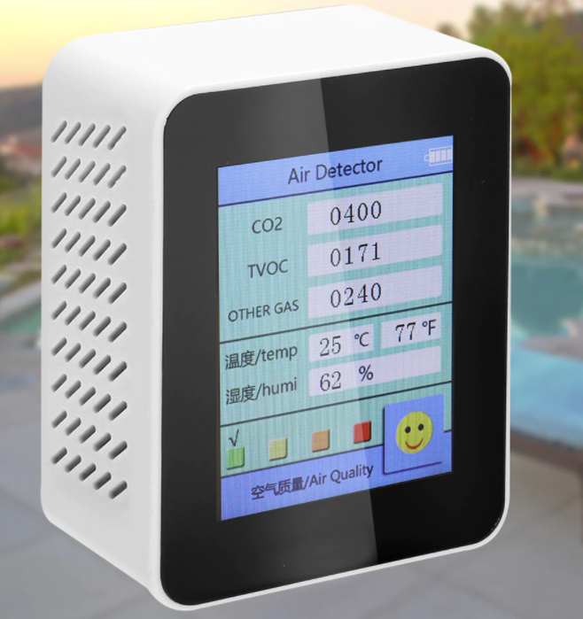
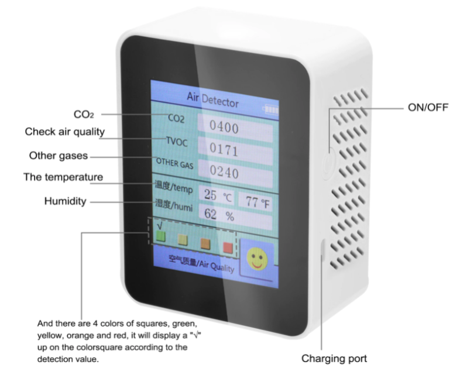

## Air Quality Detector (Genérico)
Genérico, puede encontrarse como Medidor CO2, Detector de calidad de aire, y otros nombres genéricos

### Valoración: Negativa
No adquirir el producto, posee fallas en la lectura en todos los indicadores que brinda.

### Fabricante
Desconocido

### Imágenes de referencia




### Rango de Precio
Low-Cost, suele encontrarse a menos de 70 dólares.

### Descripción usualmente utilizada

```
Al recargar el producto, conecte el cable usb del producto al ordenador para recargar, O utilícelo con el adaptador de DC 5V. Comprueba el voltaje del adaptador al recargar.

Este es un tipo de detector de calidad del aire fino, que adopta un módulo de detección electroquímica profesional, alta precisión, rendimiento estable, capacidad antiinterferencias, bajo consumo y puede proporcionar un largo tiempo de servicio. Con precisión detectar CO2. Pantalla grande, puede ver la cantidad de electricidad, el valor de CO2, el valor de TVOC, otro valor de gas, temperatura y humedad claramente. Puedes probarlo.

Características:
Tamaño compacto, ligero y portátil, fácil de sacar y transportar contigo.
Fácil operación, un botón para usar, presione y mantenga presionado durante 3s para encender/apagar, y mostrará los parámetros de calidad del aire actuales.
No es necesario calibrar después de iniciar, funcionará y detectará automáticamente.
Pantalla grande, puede ver la cantidad de electricidad, el valor de CO2, el valor de TVOC, otro valor de gas, temperatura y humedad claramente.
Utiliza un módulo de detección electroquímica profesional, alta precisión, rendimiento estable, capacidad antiinterferencias, bajo consumo y puede proporcionar un largo tiempo de servicio.
Y hay 4 colores cuadrados, verde, amarillo, naranja y rojo, mostrará un "√" en el cuadrado de color de acuerdo con el valor de detección.
Cientos de rejillas de ventilación en la parte posterior, no solo acelera la convección entre el aire y la máquina para obtener una detección efectiva, sino que también proporciona un efecto de radiación de calor fino.
Batería de litio integrada de 1200mAh de capacidad, fácil de cargar con cable USB de 5V.

Especificaciones:
Nombre: Detector de calidad del aire
Material: ABS
Color: blanco, negro(Opcional)
Capacidad de la batería: 1 * batería de litio integrada, 3,7 V, 1200mAh(Incluido)
Modo de carga: DC5V 500mA micro-usb
Detección de CO2-Rango: 400-5000PPM
Sensibilidad de detección de CO2: 1ppm
Medición de temperatura: -10 ℃ a 70 ℃
Precisión de la medición de temperatura: ± 1 ℃
Medición de humedad: 0-99% RH
Precisión de la medición de humedad: ± 2% RH
Tamaño del artículo: 93*72*42mm/3,66*2,83 * 1.65in
Peso del artículo: 147g/5,19 onzas
Tamaño del paquete: 142*130*46mm/5,59*5,12*1,81 pulgadas
Peso del paquete: 258g/9,10 onzas

Lista de embalaje:
1 * Detector de calidad del aire
1 * Cable USB
1 * directriz
```

## Tiendas
Puede encontrarse en todo tipo de tiendas, es un producto de bajo costo que los importadores pueden comprar en grandes cantidades.
Se ha detectado el producto en `Amazon`, `eBay`, `AliExpress` y `MercadoLibre`, entre otros sitios.

### Recursos

#### Pruebas y evaluaciones negativas

- **Low cost CO2-meter bought on AliExpress: does it work?** https://www.youtube.com/watch?v=kTjl4gm5Nzc

- **Medidor CO2** https://www.youtube.com/watch?v=mz9gaDZ5UjY
