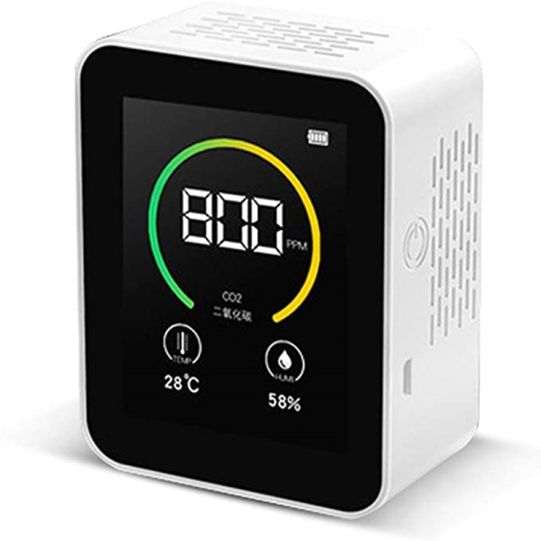
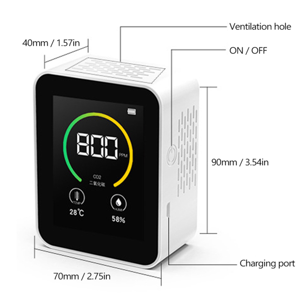

## Air Quality Detector (Genérico)
Genérico, puede encontrarse como Medidor CO2, Detector de calidad de aire, y otros nombres genéricos.
Algunos modelos referenciados, K02, KCO2, Bcamelys, CO2-METER (Koban), GoldenPlayer entre otros.

Existe una variante similar en donde el círculo de colores es en banda de 4 etapas, parece ser la versión 2.0 (TODO: Documentar variante)

### Valoración: Negativa
No adquirir el producto, posee fallas en la lectura de valores de CO2.

### Fabricante
Desconocido, de origen Chino, múltiples fabricantes diferentes en Guangdong, China lo ofrecen y permite a terceros venderlo con su propia marca.

### Imágenes de referencia




### Rango de Precio
Low-Cost, suele encontrarse a menos de 70 dólares.

### Descripción usualmente utilizada

```
Medidor Analizador de aire del hogar calidad Detector de temperatura humedad probador pantalla LCD

Este es un tipo de la calidad del aire detector que puede ser usado para probar la temperatura y la humedad y la concentración de CO2. Equipado con gran pantalla digital con retroiluminación puede ver el resto de la cantidad de CO2 valor datos de temperatura y humedad claramente El círculo de color a cambiado de acuerdo a la detección de datos.

Características:
Múltiples funciones en tiempo real de la concentración de CO2 de temperatura y humedad
De calidad seleccionados sensor de alta precisión anti-interferencia con una reacción rápida velocidad
Equipado con gran pantalla digital con retroiluminación puede ver el resto de la cantidad de CO2 valor datos de temperatura y humedad claramente
El círculo de color a cambiado de acuerdo a la detección de datos
¿Las áreas de aplicación: agricultura: plantar verduras de invernadero de almacén de material de interior de la casa?

Especificaciones:
Nombre: CO2 Detector
Material: ABS
Pantalla: Pantalla LCD + retroiluminación
Color: negro blanco(Opcional)
Batería: 1 * batería recargable 3,7 V 1200mAh(Incluido)
Temperatura aplicable: -1 ℃ a 70 ℃
Aplicable humedad: 10-70% RH
Vigilancia Flotador: 20%-50%
Estándar de carga: 5V-1A
Tiempo de espera: alrededor de 300-420 minutos
Tamaño del artículo: 90*70*35mm/3,54*2,76 * 1.38in
Tamaño del paquete: 145*130*45mm/5,71*5,12 * 1.77in
Peso del paquete: 200g/7,05 onzas

Lista de embalaje:
1 * CO2 Detector
1 * Cable USB
1 * directriz
```

## Tiendas
Puede encontrarse en todo tipo de tiendas, es un producto de bajo costo que los importadores pueden comprar en grandes cantidades.
Se ha detectado el producto en `Amazon`, `eBay`, `AliExpress` y `MercadoLibre`, entre otros sitios.

### Recursos

#### Pruebas y evaluaciones negativas

- **Medidor CHINO ¿funcionan bien?** https://www.youtube.com/watch?v=uisDpswBeAQ
