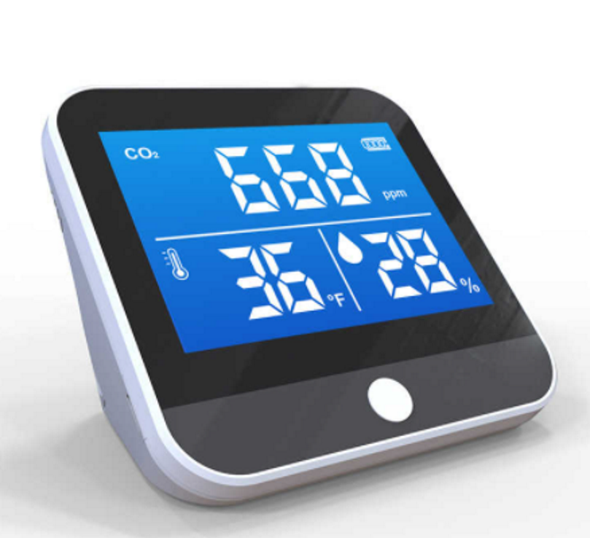
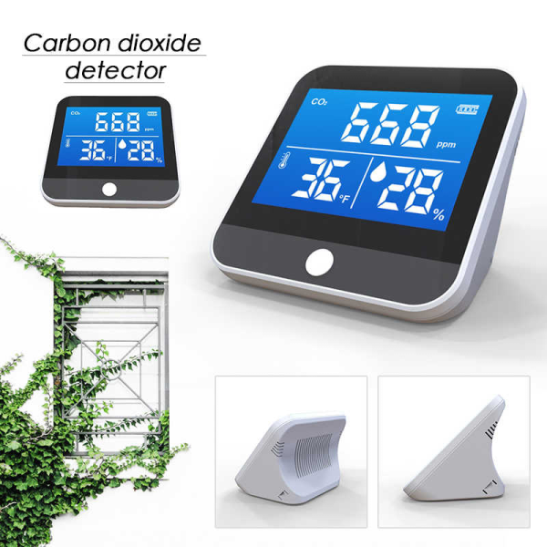

## Detector de CO2 (Genérico)
Genérico, puede encontrarse como Medidor CO2, Detector de calidad de aire, y otros nombres genéricos.
El dato que generalmente se referencia es DM306 o DM306C, puede encontrarse también como Epea, YourChecker o Air Quality Monitor entre otros.

### Valoración: Positiva
El producto posee un sensor chino NDIR (QC103) con una calidad aceptable para el rango de precio y características brindadas.

**Nota:** Algunas personas que han realizado revisiones al hardware indican que la precisión y performance del producto mejoran si se usa un cargador que brinde 1A de salida mínimo.

### Fabricante
Desconocido, de origen Chino.

### Imágenes de referencia




### Rango de Precio
Low-Cost, suele encontrarse en un rango de precios entre los 60 a 90 dólares.
En tiendas de distribuidores es posible conseguirlos a un precio mayorista entre 33 dóalres y 41 dólares.

### Descripción usualmente utilizada

```
Detector de CO2 recargable, Analizador de Sensor de CO2, medidor, Monitor de calidad del aire multifuncional, Detector de temperatura, Monitor de humedad

Descripciones:


Este detector de calidad del aire multifuncional realiza la función 3 en 1: CO2, temperatura y humedad. La combinación de infrarrojos (NDIR) y la tecnología del sensor de temperatura y humedad permite registros precisos de CO2, temperatura y humedad. Estos tres índices se mostrarán claramente en la pantalla digital.


Características:


Detección de 3 índices, incluyendo CO2, temperatura y humedad.

La tecnología infrarroja realiza el registro preciso de la concentración de CO2, que oscila entre 400 y 5000ppm.

La supervisión en tiempo Real le permite conocer los datos exactos de cada segundo.

Todos los datos se mostrarán claramente en la pantalla digital.

La batería de litio de 2000amh garantiza un largo tiempo de trabajo.


Especificaciones:


Nombre del artículo: detector de calidad del aire multifunción CO2 DM306C

Material: metal + ABS

Color: Negro

Método de visualización: pantalla común

Artículos de medición: CO2, temperatura y humedad

Tecnología de CO2: Infrarrojo (NDIR)

Rango de detección: CO2( 400-5000 ppm)

Batería: 1 * batería de litio 3,7 v 2000mAh (incluida)

Fuente de alimentación: Carga USB

Tamaño del artículo: 9*9*5cm

Peso del artículo: 225g


Paquete de información:


Tamaño del paquete: 13*13*9cm

Peso del paquete: 360g

Lista del paquete: 1 * Unidad Principal; 1 * manual;1 * cable de carga

Paquete de caja
```
### Datos técnicos del Sensor CO2 QC103

**Measurement range:** 	400-5000ppm Expandable 0-6000 ppm

**Accuracy:**	 +/-50ppm plus5%reading (1)(2).

**Response time (t90):**	<120s

**Warm-up time	<8s:** (output value).<120s(accurate output).

**Measurement cycle:**	4s

**Temperature dependence:**	± 5 ppm/C or 0.5% reading/

**Operating voltage:**	4.5-5.5V

**Output signal:**	UART, PWM, I2C (customized).

**Communication level:**	3.3V

**Average current:**	<30mA (5V)

**Operating temperature:**	0 - 50 °C

**Operating humidity:**	0 to 95%RH no condensation

**Operating pressure:**	700~1100mbar

**Store the temperature:**	-20.0 ~ 60.0 °C

**Product size:**	33mm X 21mm X 11mm (without pins).

**Life expectancy:**	10 years

**Calibration cycle:**	No calibration required (turn on self-calibration in normal IAQ applications).

(1): Accuracy is measured at room temperature of 25degrees C and atmospheric pressure of 101.3kpa. To verify sensor uncertainty, add uncertainty (±2%) of the standard gas used for calibration.

(2): In normal indoor air quality applications, sensor accuracy is defined for more than 3 minutes after the auto-calibration function is turned on and running continuously for three weeks.

(3): Auto-calibration is based on the atmospheric atmosphere CO2 concentration of 400ppm, as a reference point sensor automatically perform calibration algorithm, the default auto-calibration cycle is 24 hours, support custom calibration cycle.

## Tiendas
Puede encontrarse en todo tipo de tiendas, es un producto de bajo costo que los importadores pueden comprar en grandes cantidades.

#### Uruguay:

Compras en extranjero con gestión de franquicia de aduana y costos de envío con soporte desde Uruguay.

- **TiendaMia** Amazon https://tiendamia.com/search?amzs=DM306C

- **TiendaMia** Walmart https://tiendamia.com/search?amzs=DM306C&vendor=ebay&vendor=wrt

#### Internacional:

Tener en cuenta gastos de envío y costos de aduana. También que se está realizando compra y negociación en país extranjero.
Revisar la reputación del vendedor y ver las reviews de los usuarios antes de comprar.

- **Alibaba** (2 piezas a USD 40.50 la unidad, USD 33 si son +500 piezas) https://www.alibaba.com/product-detail/LCD-Display-Air-quality-monitor-measure_1600205725408.html

- **AliExpress** https://es.aliexpress.com/af/DM306C.html


### Recursos

#### Pruebas y evaluaciones

- **Destripe (teardown) e Ingeniería Inversa Medidor CO₂ y Partículas DM306 / WS1125** https://emariete.com/destripe-teardown-ingenieria-inversa-medidor-co2-particulas-dm306-ws1125/
